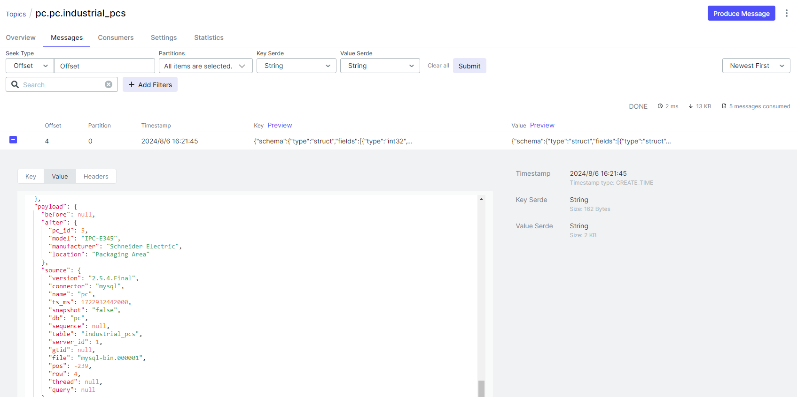

# Deploy Debezium Guide
Deploy Debezium to get changing data capture from database and how to configure data from MariaDB to Kafka.   


## Overview

- Tool: Debezium v2.7


## Run

### Docker
```
docker compose up -d
```


## API

- POST http://localhost:8083/connectors/ start
- GET http://localhost:8083/connectors/ get all cdc
- GET http://localhost:8083/connectors/{name}/status get cdc status
- DELETE http://localhost:8083/connectors/{name} delete cdc

## Deploy

- MariaDB: refer to [mariadb.md](./mariadb/mariadb.md)


## Kafka
